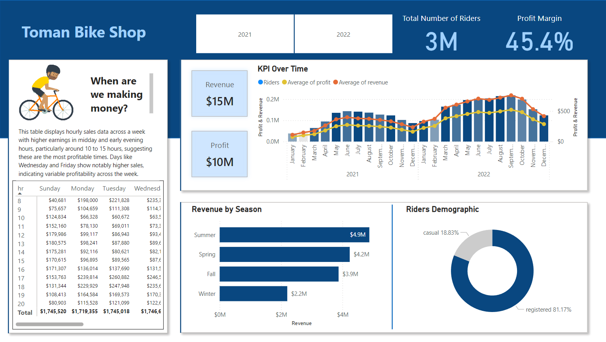

# Toman Bike Shop Sales Performance Dashboard

## Introduction
The Toman Bike Shop Sales Performance Dashboard is a Power BI project designed to provide key performance metrics for informed decision-making. The dashboard includes analyses of hourly revenue, profit, and revnue trends, seasonal revenue, and rider demographics. 

## Data Analysis Workflow
1. Create a Database: Set up a database using MySQL to store bike share data.
2. Develop SQL Queries: Write SQL queries to extract relevant data for analysis.
3. Connect Power BI to DB: Establish a connection between Power BI and the database.
4. Build a Dashboard in Power BI: Create interactive visualizations and dashboards in Power BI.
5. Answer the Analysis Questions: Use the dashboard to answer key business questions and provide insights.

## Key Performance Metrics
* Hourly Revenue Analysis: Track revenue generated each hour.
* Profit and Revenue Trends: Analyze trends in profit and revenue over time.
* Seasonal Revenue: Identify revenue patterns across different seasons.
* Rider Demographics: Examine the demographics of casual and registered riders.

## Usage

* Download and Install [Power BI Desktop](https://powerbi.microsoft.com/en-us/desktop/). 
* Open the "Toman Bike Shop.pbix" file in Power BI Desktop.
* Use filters to select specificyear, seasons, time periods, or rider demographics.
* Click on data points to drill down into specific details. 

### Screenshot

## Recommendations 

Considering the increase last year, a more conservative increase might be crucial to avoid a hitting a price ceiling where demand starts to drop. An increase of 10-15% could test the market's response without risking a significant loss of customers.

#### Price Setting:

If the price in 2022 was $4.99, a 10% increase would make the new price about $5.49.
A 15% increase would set the price at ~$5.74.

#### Recommended Strategy:

* Market Analysis: conduct further research to better understand customer satisfaction, potential competitive changes, and the overall economic environment. This can guide whether leaning towards the lower or higher end of the suggested increase.
* Pricing Strategy: consider different pricing for casual vs registered users, as they may have different price sensitivities.
* Monitor and Adjust: implement new prices but be ready to adjust based on immediate customer feedback and sales data. Monitoring will allow you to fine-tune your pricing strategy without committing to a price that might turn out to be too high. 